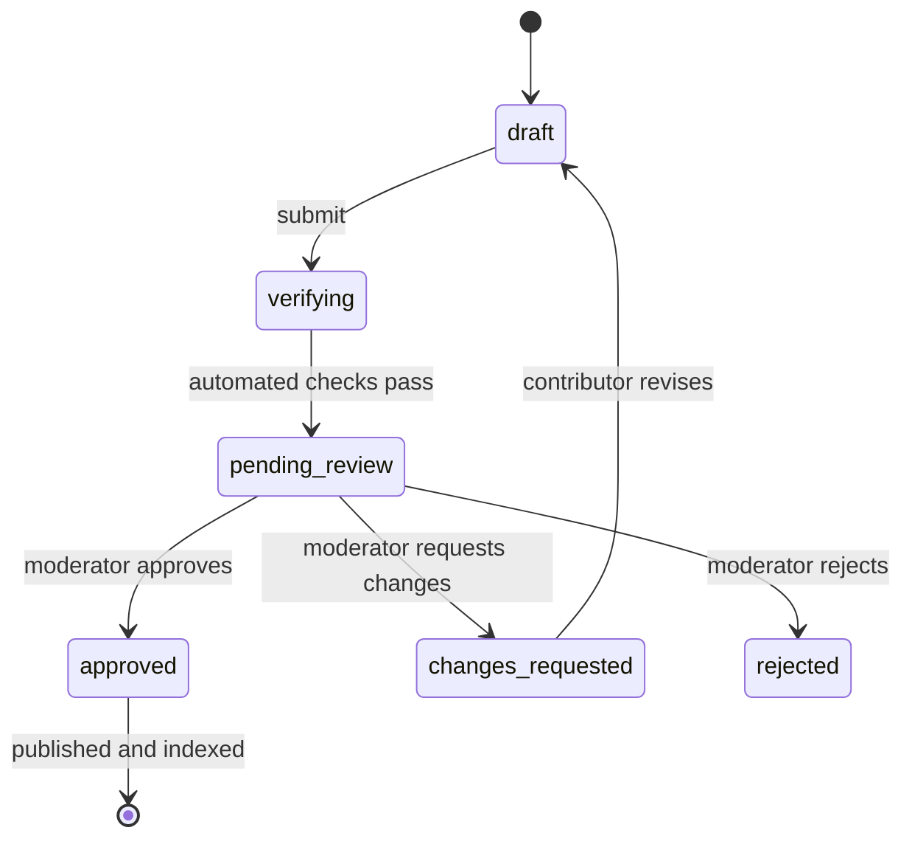

<div align="center">

# aviation.wiki

**The free encyclopedia of aircraft, airlines, engines, airports, and aviation history.**

Sourced articles · public revision history · moderator-reviewed contributions

[](https://github.com/byalex33/aviation-wiki/actions/workflows/ci.yml)
[](LICENSE)
[](CONTENT-LICENSE.md)
[](https://nextjs.org)
[](https://www.typescriptlang.org)

[**Live site**](https://www.aviation.wiki) · [Contributing](CONTRIBUTING.md) · [Security](SECURITY.md) · [Content licensing](CONTENT-LICENSE.md)

</div>

---

aviation.wiki is a community encyclopedia for aviation. Anyone can read; signed-in
contributors propose changes as revisions; every published version is the result
of a moderator decision, and the full history stays public. Structured data can
be seeded from Wikidata and Wikimedia Commons, but nothing reaches readers without
review.

## Features

**Reading**
- Full-text search across every approved article, with per-type and per-country filters
- Seven content types — aircraft, airlines, alliances, airports, manufacturers, engines, and events
- Side-by-side comparison pages, a queryable fleet database (`/api/fleet.json`, `/api/fleet.csv`), and an aviation-news archive
- Per-article revision history with a diff view of any two approved versions

**Contributing**
- A constrained Markdown dialect with validated citations and ten article blocks
  (`Infobox`, `Notice`, `Sidebar`, `Chart`, `Sources`, `FleetTable`,
  `Specifications`, `Timeline`, `Gallery`, `RelatedPages`)
- Draft → review → publish workflow with verification checks, moderator notes, and
  change requests
- Wikidata and Wikimedia Commons import previews that only ever create private drafts
- Article watches and in-app / email digest notifications

**Operations**
- Role-based access (contributor, trusted contributor, moderator, admin) backed by Clerk
- PostgreSQL-backed rate limiting on every mutation endpoint
- Scoped, hashed API keys and an external drafts API (`POST /api/v1/drafts`)
- Structured data output — JSON-LD, image sitemap, `robots.txt`, IndexNow, generated OpenGraph images
- Admin dashboard: articles, contributors, imports, source health, notifications, and a full audit log

## How a change reaches readers



Staff submissions publish immediately; everyone else's pass through review. Only
moderators and admins can approve.

## Tech stack

| Layer | Choice |
| --- | --- |
| Framework | Next.js (App Router, Turbopack, React Server Components) |
| Language | TypeScript, `strict` |
| Auth | Clerk |
| Database | PostgreSQL via [`postgres`](https://github.com/porsager/postgres) — any managed provider (Neon, Aiven, …) |
| UI | Tailwind CSS v4, shadcn/ui, Base UI, Recharts |
| Content | `unified` / `remark` Markdown pipeline with a custom validator |
| Hosting | Vercel (Fluid Compute, Cron) |
| Email | Resend (optional) |

## Getting started

### Prerequisites

- Node.js `^20.9` or `>=22`
- npm
- A PostgreSQL database (the dev role needs schema-creation permission for first run)
- A [Clerk](https://clerk.com) application (a free development instance is fine)

### Setup

```sh
git clone https://github.com/byalex33/aviation-wiki.git
cd aviation-wiki
npm ci
cp .env.example .env.local     # fill in the three required values below
npm run dev                    # http://localhost:3000
```

The first database-backed request in development creates the schema and seeds the
built-in article. Never commit a populated `.env.local`.

### Environment variables

**Required**

| Variable | Purpose |
| --- | --- |
| `NEXT_PUBLIC_CLERK_PUBLISHABLE_KEY` | Public Clerk key |
| `CLERK_SECRET_KEY` | Server-side Clerk key |
| `DATABASE_URL` | PostgreSQL connection string |

**Optional**

| Variable | Purpose |
| --- | --- |
| `DATABASE_POOL_SIZE` | Connections per server instance (default `1`) |
| `NEXT_PUBLIC_APP_URL` | Canonical site URL (default `http://localhost:3000`) |
| `RESEND_API_KEY`, `NOTIFICATION_EMAIL_FROM` | Notification email delivery |
| `CRON_SECRET` | Bearer token protecting `/api/cron/*` |
| `GOOGLE_SITE_VERIFICATION`, `BING_SITE_VERIFICATION`, `INDEXNOW_KEY` | Search-engine discovery |
| `AVIATION_WIKI_DB_PATH` | Path for the legacy SQLite store used by local checks |

`NEXT_PUBLIC_`-prefixed variables are exposed to the browser and fixed at build time; everything else is server-only.

### Accounts and roles

New Clerk users are contributors. Grant staff access through the user's public
metadata in the Clerk dashboard:

```json
{ "role": "moderator" }
```

Valid roles: `contributor`, `trusted_contributor`, `moderator`, `admin`. Only
moderators and admins publish; imports and role management are admin-only.

## Project structure

| Path | Responsibility |
| --- | --- |
| `src/app` | App Router pages, Route Handlers, metadata, Server Actions |
| `src/components` | Article, revision, search, notification, and interface components |
| `src/lib/wiki-public-db.ts` | Primary data module — public reads, contributions, moderation, admin, search index |
| `src/lib/postgres.ts` | Connection pool and development schema bootstrap (source of truth for the schema) |
| `src/lib/article-markdown.ts` | Markdown parser and validator — all submitted content passes through it |
| `src/lib/import-providers/` | Wikidata and Wikimedia Commons import previews |
| `src/proxy.ts` | Clerk request context + Content-Security-Policy |
| `scripts/` | Offline integrity checks and controlled publishing scripts |

`src/lib/wiki-db.ts`, `admin-db.ts`, and `notification-db.ts` are legacy SQLite
modules kept only for local checks and a few fallback paths — new work uses
`wiki-public-db.ts`.

## Testing and checks

```sh
npm run lint          # ESLint
npm run typecheck     # tsc --noEmit
npm test              # offline suites — parser, charts, citations, relationships,
                      # search, importer, notifications, fleet, source health
npm run build         # production build (needs Clerk + DATABASE_URL)
npm audit --omit=dev --audit-level=high
```

`npm test` runs without any external services. `npm run test:db` separately
validates a local SQLite database. Pull requests run lint, typecheck, `npm audit`,
and the test suite in GitHub Actions.

## Deployment

Configured for Vercel. Before the first production deploy:

1. Initialise the PostgreSQL schema from a trusted environment using the production `DATABASE_URL` (production never runs DDL during requests).
2. Set the required Clerk and database variables, plus a random `CRON_SECRET`.
3. Add optional email and search-discovery variables as needed.

`vercel.json` schedules the daily source-health cron. See
[DATABASE-OPERATIONS.md](DATABASE-OPERATIONS.md) for backup, migration, and
rollback procedures.

## Contributing

Bug reports, features, and code are welcome — see [CONTRIBUTING.md](CONTRIBUTING.md)
for setup and the review process. Articles are contributed through the running
application, not pull requests. All participation is covered by the
[Code of Conduct](CODE_OF_CONDUCT.md); report security issues privately per
[SECURITY.md](SECURITY.md).

## License

| | |
| --- | --- |
| Software | [GNU AGPL v3](LICENSE) — see [NOTICE](NOTICE) |
| Project-authored content | [CC BY-SA 4.0](https://creativecommons.org/licenses/by-sa/4.0/) |
| Imported data & media | Per-source terms — [CONTENT-LICENSE.md](CONTENT-LICENSE.md) |

Contributing code licenses it under AGPL-3.0-only; contributing original editorial
content licenses it under CC BY-SA 4.0.
